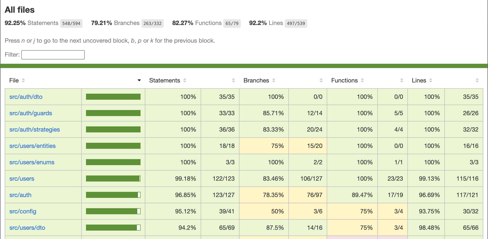
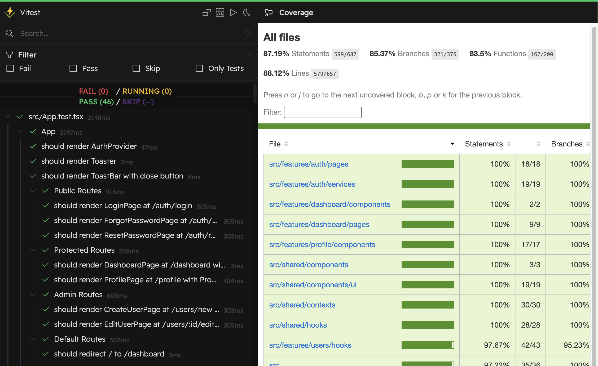

# Corum FS

Application full-stack pour gestion utilisateurs (CRUD)

## Stack Technique

- **Backend** : NestJS + Fastify, TypeORM, PostgreSQL
- **Frontend** : React 19 + Vite, TypeScript, Tailwind CSS
- **Monorepo** : Turborepo + Yarn Workspaces

## Archi Backend

### Throttling (Rate Limiting)
**Lib** : `@nestjs/throttler`

Limitation de débit multi-niveaux (global + spécifique) :
- Niveaux : `short` (10 req/s), `medium` (20 req/10s), `long` (100 req/min)
- Endpoints auth : `/auth/register` (3/min), `/auth/login` (5/min), `/auth/forgot-password` (10/min)

### Authentification et Autorisation
`@nestjs/jwt`, `@nestjs/passport`, `passport-jwt`

- JWT stateless : Access tokens (15min) + refresh tokens (7j) avec rotation
- Deux stratégies Passport : `JwtStrategy` (header `Authorization`) et `JwtRefreshStrategy` (body `refreshToken`)
- Secrets séparés : `JWT_SECRET` et `JWT_REFRESH_SECRET` (≥32 caractères)
- Validation utilisateur à chaque requête, endpoint `/auth/refresh` avec throttling (10 req/min)
- **Guards** : `JwtAuthGuard` (global, `@Public()` pour bypasser), `RolesGuard` (explicite, `@Roles(Role.ADMIN)`)
- Ordre d'exécution : ThrottlerGuard → JwtAuthGuard → RolesGuard

### Pagination par Curseur et Base de Données
**Lib** : `typeorm` (QueryBuilder, `@Index` decorator)

- **Pagination** : Curseur basé sur ID avec tiebreaker sur champ de tri
- **Tri** : `createdAt`, `updatedAt`, `firstName`, `lastName`, `email`, `birthdate` (ASC/DESC)
- **Filtrage** : Recherche unifiée ou filtres individuels
- **Limite** : 1-100 éléments/page (défaut: 10), métadonnées : `nextCursor`, `hasMore`, `count`, `limit`
- **Indexes composites** : `(champ, id)` pour pagination optimisée sur tous les champs de tri + `(role, createdAt)`
- **Index unique** : `email` pour contraintes d'intégrité

### Sécurité
`@fastify/helmet`, `bcrypt`, `class-validator`, `class-transformer`

- **En-têtes de sécurité** : Protection XSS, clickjacking, MIME sniffing, HSTS, referrer policy
- **Protection timing** : Hachage dummy si utilisateur inexistant, comparaison timing-safe, messages d'erreur génériques (pas d'énumération utilisateur)
- **Hachage** : bcrypt 12 rounds pour mots de passe
- **Validation d'environnement** : Variables validées au démarrage

### Validation et Sérialisation
`class-validator`, `ValidationPipe`, `class-transformer`, `ClassSerializerInterceptor`

- **ValidationPipe global** : `whitelist`, `forbidNonWhitelisted`, `transform` activés
- **Validation par DTO** : Décorateurs `class-validator` (`@IsString()`, `@IsEmail()`, etc.)
- **Sérialisation** : Exclusion automatique des propriétés `@Exclude()` (password, passwordResetToken, passwordResetExpires)

### Documentation API (Swagger)
`@nestjs/swagger`
- **Swagger UI** : Disponible sur `/api`
- **DTOs documentés** : Décorateurs `@ApiProperty()`, `@ApiTags()`, `@ApiOperation()` pour documentation automatique

### Health Checks (Terminus)
`@nestjs/terminus`

- **Endpoints** : `/health` (check complet), `/health/liveness` (database uniquement), `/health/readiness` (database + mémoire)
- **Vérifications** : Database (ping PostgreSQL), mémoire heap (seuil 300MB), mémoire RSS (seuil 500MB)
- **Intégration** : Compatible avec Kubernetes liveness/readiness probes et orchestrateurs

### Tests
`jest`, `@nestjs/testing`

- **Tests unitaires** : Controllers, services, guards, strategies, decorators, modules



*Couverture : 92.25% Statements, 79.21% Branches, 82.27% Functions, 92.2% Lines*

## Archi Frontend

### Performance
- **Lazy loading** : Pages chargées dynamiquement avec code splitting automatique par route (`React.lazy`, `Suspense`)

### Authentification et Routing
`react` (Context API), `react-router-dom`, `axios`

- **AuthContext** : État global (`user`, `isAuthenticated`, `isLoading`), hook `useAuth()` (`login()`, `logout()`, `refreshUser()`)
- **Client HTTP** : Intercepteurs Axios (ajout token JWT, refresh auto sur 401, retry)
- **Routing** : Routes publiques (`/auth/*`), protégées (`/dashboard`, `/profile`), admin (`/users/*`), `ProtectedRoute`

### Formulaires et Validation
`react-hook-form`, `@hookform/resolvers`, `zod`, `react-hot-toast`

- **Validation** : Schémas Zod TypeScript-first avec types générés (`z.infer<>`), validation optimisée
- **Schémas** : login, forgotPassword, resetPassword, profile, changePassword, createUser, updateUser
- **Gestion d'erreurs** : `handleApiError()` / `handleApiSuccess()`, hook `useFormSubmission` (loading, messages, redirection, callbacks)

### Données et Tableaux
`@tanstack/react-table`, `date-fns`, `react-day-picker`

- **Pagination curseur** : Hook `useUsersList` (curseur, `hasMore`, filtres, tri, chargement incrémental)
- **Tableaux** : Tri serveur, colonnes configurables, actions inline, sélection multiple
- **Dates** : Composant `DatePicker` avec validation

### Hooks et Tests
`vitest`, `@testing-library/react`, `@testing-library/jest-dom`

- **Hooks réutilisables** : `useAsyncOperation`, `useFormSubmission`, `useAuth`, `useUsersList`
- **Tests** : Tests orientés utilisateur



*Couverture : 87.19% Statements, 85.37% Branches, 83.5% Functions, 88.12% Lines*

### Autres
`clsx` + `tailwind-merge`, `react-icons`, TypeScript strict, path aliases `@/`, React StrictMode

## Démarrage Local

### Prérequis
Node.js ≥ 18, Yarn 1.22.0, Docker & Docker Compose

### Installation et Lancement

```bash
yarn
yarn serve
```

**Ce que fait `yarn serve`** :

Orchestration via Turborepo qui exécute en parallèle :

1. **Frontend** (`apps/frontend`) : Build (`yarn build`) puis serve en mode preview (`vite preview`) sur `http://localhost:3000`
2. **Backend** (`apps/backend`) : Build et démarrage Docker (PostgreSQL + NestJS) puis seed automatique (1 admin + 20 users) sur `http://localhost:4000`

**URLs** : Frontend `http://localhost:3000`, Backend `http://localhost:4000`, API docs `http://localhost:4000/api`

**Note** : Pour réexécuter le seed manuellement, utilisez `yarn docker:seed` depuis `apps/backend`

### Commandes
- `yarn dev` : Mode développement (HMR activé)
- `yarn dev:backend` / `yarn dev:frontend` : Backend ou frontend uniquement
- `yarn build` : Build production
- `yarn clean` : Nettoyage + arrêt Docker
- `yarn lint` : Linting
- `yarn test` : Tests unitaires

### Comptes de Test
- **Admin** : `admin@example.com` / `AdminPassword123!`
- **Utilisateurs** : `[prenom].[nom]@example.com` / `Password123!`

## Structure du Projet


```
corum-fs/
├── apps/
│   ├── backend/          # NestJS + Fastify
│   │   ├── src/
│   │   │   ├── auth/     # JWT, Passport, bcrypt
│   │   │   ├── users/    # CRUD, pagination curseur
│   │   │   ├── database/ # TypeORM, migrations, seed
│   │   │   └── config/   # Throttler, validation env
│   │   └── Dockerfile
│   └── frontend/         # React + Vite
│       ├── src/
│       │   ├── features/ # Modules métier (auth, users, profile, dashboard)
│       │   └── shared/   # Services, types, composants réutilisables
│       └── vite.config.ts
├── docker-compose.yml
├── turbo.json
└── package.json
```
**Architecture Feature-based** : Organisation par fonctionnalités (`features/auth`, `users`, `profile`, `dashboard`) avec code partagé (`shared/`)

## Configuration

Variables d'environnement backend : `apps/backend/.env.docker` (Docker) ou `apps/backend/.env` (dev local)

**Requises** :
- `DATABASE_URL` : URL PostgreSQL (host, port, base, user, password, SSL)
- `JWT_SECRET` : Secret access tokens (≥32 caractères)
- `JWT_REFRESH_SECRET` : Secret refresh tokens (≥32 caractères)

**Optionnelles** :
- `NODE_ENV` : `development` (défaut), `production`, `test`
- `PORT` : Port HTTP backend (défaut `4000`)
- `LOAD_CA` : Charger certificat CA PostgreSQL (`true`/`false`)
- `JWT_ACCESS_EXPIRATION` : Durée access tokens (`15m` par défaut)
- `JWT_REFRESH_EXPIRATION` : Durée refresh tokens (`7d` par défaut)
- `THROTTLE_SHORT_LIMIT` : Limite courte (défaut `10`)
- `THROTTLE_MEDIUM_LIMIT` : Limite moyenne (défaut `20`)
- `THROTTLE_LONG_LIMIT` : Limite longue (défaut `100`)
- `PASSWORD_RESET_EXPIRY_HOURS` : Validité tokens reset (défaut `1`)

**Note** : Variables validées au démarrage via `class-validator` dans `env.validation.ts`

### Frontend

Variables d'environnement : `apps/frontend/.env` ou `apps/frontend/.env.local` (optionnels)

- `VITE_API_URL` : URL API backend (défaut `/api`). En développement, proxy Vite redirige vers `http://localhost:4000`. En production, définir l'URL réelle du backend

**Note** : Variables Vite doivent être préfixées par `VITE_` pour être exposées au client

## TODO

- **Tests d'intégration** : Implémentation de tests d'intégration pour valider les interactions entre composants
- **Tests E2E** : Mise en place de tests end-to-end pour valider les flux utilisateur complets
- **Tests de charge** : Implémentation de tests de charge pour le backend afin de valider les performances sous contrainte
- **Monitoring** : Mise en place d'un système de monitoring pour suivre les performances et la santé de l'application
- **Logging amélioré** : Amélioration du système de logging avec structuration, niveaux de log et agrégation centralisée
